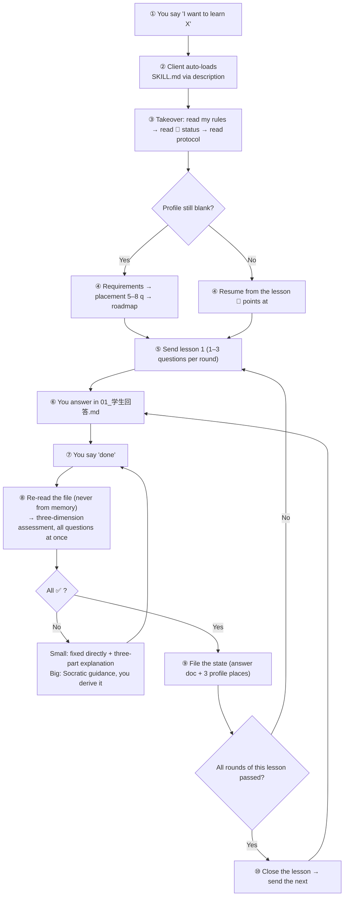

# Steps2Great-skill

[](https://github.com/wildcat430524/Steps2Great-skill/actions/workflows/check.yml)
[](./LICENSE)
[](./LICENSE-DOCS)
[](https://code.claude.com/docs/en/skills)

> **Turn any AI that supports Agent Skills into your one-on-one tutor.**
> Placement test → roadmap → 1–3 questions per round → advance only when all three dimensions are ✅ → errors explained properly before moving on.

**It is not an app, not a course, not a website.** It is a **197-line `SKILL.md`** (~6.5 KB):
install it, and the AI stops being a Q&A machine and starts **tutoring you under a protocol**.

**It teaches no particular subject** — it defines **how to teach**. Programming, English, exams, maths, humanities — the same rules.

It grew out of [StepsToGreat](https://github.com/wildcat430524/StepsToGreat), which turned a whole folder into a tutor via `AGENTS.md`.
This repo packages that same protocol into an **installable, distributable, verifiable** Agent Skill.

English | [简体中文](./README.md)

**Contents**

[Start in 30 seconds](#start-in-30-seconds) ·
[Why a skill version](#why-a-skill-version-at-all) ·
[Install](#install-pick-one) ·
[First run](#first-run) ·
[Who it's for](#who-its-for-who-it-isnt) ·
[How it works](#how-it-works) ·
[The rules it enforces](#the-rules-it-enforces) ·
[A complete walkthrough](#a-complete-dialogue-walkthrough) ·
[How the rules were verified](#how-these-rules-were-verified) ·
[Language strategy](#language-strategy-one-language-only-or-both) ·
[Repository layout](#repository-layout) ·
[Adaptive updates](#adaptive-updates) ·
[Development](#development) ·
[FAQ](#faq) ·
[Going deeper](#going-deeper) ·
[License](#license)

---

## Start in 30 seconds

**Don't read further yet.** Just three things:

| # | Do this | You should see |
|---|---|---|
| **1** | Install it in one line: `npx skills add wildcat430524/Steps2Great-skill` | It lands in your client's skills directory (Claude Code: `~/.claude/skills/steps2great-skill/`) |
| **2** | Say: `I want to learn Python so I can process Excel files myself. 30 minutes a day.` | It asks about your goals, runs a placement test, lays out a roadmap, **sends lesson 1** |
| **3** | Ask it: `How many hard rules are in the SKILL.md you loaded?` | **11** = the skill is installed *and* actually read |

> **Prefer not to use `npx`?** A plain `git clone` into a skills directory works just as well — see [Install](#install-pick-one).

> **Why step 3 matters**: most clients have no "loaded skills" panel, so
> **asking the AI to recite the hard-rule count is the only reliable check**. No answer → see [FAQ](#faq).

From then on you only ever do two things: **write answers in the answer file**, and **say "done"**.

---

## Why a skill version at all

The previous generation, [StepsToGreat](https://github.com/wildcat430524/StepsToGreat), already proved the protocol works:
a folder plus an `AGENTS.md` file, and any AI that can read a folder becomes a tutor.

But it has three hard limits — **all of them caused by the "folder" form, not by the protocol**:

| Upstream limit | How the skill version solves it |
|---|---|
| Rules must **travel with the repo** — a new project means dropping the folder in again | Install once into the skills directory; **every project and every session can trigger it** |
| Triggering depends on **whether the tool reads `AGENTS.md`** — 25 pointer files covering 28+ tools, each maintained by hand | Triggering rides the **frontmatter `description`** (bilingual trigger words), which every Agent Skills client reads |
| Content **drifts when hand-copied** — change a rule, forget a copy | `references/` is a **mirrored build artifact**; change upstream, run the sync script, CI verifies consistency |
| Nobody checks **whether the protocol was followed** | A state validator (11 invariants) + 11 regression cases + CI on every push |

### How the two divide the work

| | [StepsToGreat](https://github.com/wildcat430524/StepsToGreat) | **Steps2Great-skill** (this repo) |
|---|---|---|
| Form | A folder (open it and it is your tutor) | An Agent Skill (install into any client) |
| Trigger | `AGENTS.md` + 25 per-tool pointers | Frontmatter `description` (bilingual triggers) |
| Content source | The repo itself | **Mirrors** upstream + a hand-written `SKILL.md` |
| Best for | "One folder carries everything"; reading all the design docs | "Install once, use everywhere"; distributing / sharing with a team |
| Your data | Your folder | Your workspace — **both plain Markdown, mutually resumable** |

> **They are two shells around one protocol.** Change a teaching rule upstream, run
> `node _build/sync-from-upstream.mjs` here, and it follows — nothing hand-copied, so nothing drifts.

### Versus pasting a prompt into your AI

| | Paste a prompt | Steps2Great-skill |
|---|---|---|
| **Auto-triggered** | ❌ You must remember to paste it | ✅ Say "I want to learn X" and it loads |
| Rule length | Whatever you'll paste (usually a few hundred words) | **Read on demand** — a 197-line contract + 64 references, fetched as needed |
| Drift | Versions everywhere | Single source of truth + mirror script + CI |
| State | In the conversation, gone when it closes | In your workspace files — **survives switching clients** |
| Verifiable | ❌ | ✅ 11 invariants + 11 regression cases |

---

## Install (pick one)

### 1. Via the skills CLI (one command — the ecosystem-standard way)

```bash
npx skills add wildcat430524/Steps2Great-skill
```

It asks which client to install for (Claude Code / Cursor / Codex / Gemini / Cline / Roo / Trae / Zed …)
and drops it in the right skills directory. Common flags:

```bash
npx skills add wildcat430524/Steps2Great-skill -g              # global (every project)
npx skills add wildcat430524/Steps2Great-skill -a claude-code  # target one client
npx skills list                                                # what's installed
npx skills update                                              # update everything
```

### 2. Clone it manually as a personal skill (available in every project)

Clone the repo into your skills directory as `steps2great-skill` (matching the frontmatter `name`):

```bash
# Claude Code / compatible Agent Skills clients
git clone https://github.com/wildcat430524/Steps2Great-skill.git ~/.claude/skills/steps2great-skill
```

Windows PowerShell:

```powershell
git clone https://github.com/wildcat430524/Steps2Great-skill.git "$env:USERPROFILE\.claude\skills\steps2great-skill"
```

**Which directory each client reads** (check your client's docs if unsure; `-g` installs user-level, omitting it installs project-level):

| Client | User-level | Project-level |
|---|---|---|
| Claude Code | `~/.claude/skills/` | `.claude/skills/` |
| OpenAI Codex | `~/.codex/skills/` | `.codex/skills/` |
| Cursor | `~/.cursor/skills/` or `~/.agents/skills/` | `.cursor/skills/` or `.agents/skills/` |
| Gemini / Antigravity | `~/.gemini/config/skills/` | `.agents/skills/` |
| Generic (shared by several clients) | `~/.agents/skills/` | `.agents/skills/` |

> Cursor also **reads Claude and Codex directories** for compatibility — so one install into `~/.claude/skills/`
> is enough for it too. To share one directory across clients, use `~/.agents/skills/` (or symlink it into each client's directory).

Then type `/steps2great-skill`, or just say "I want to learn X" and let the model load it.

### 3. Project skill (travels with the repo)

```bash
mkdir -p .claude/skills && git clone https://github.com/wildcat430524/Steps2Great-skill.git .claude/skills/steps2great-skill
```

### 4. Bundle it into a plugin / distribute it

`package.json` ships a `files` allowlist (`SKILL.md` + `references/` + `templates/` + `scripts/`),
so it works as an npm package or a git dependency. Other skills can reach it via `skill steps2great-skill`.

> **Node is optional.** The scripts exist for workspace init, self-check, and updates.
> You can also just say "I want to learn X, set me up" and let the AI create the folders by hand.

---

## First run

One sentence is enough:

> **"I want to learn Python so I can process Excel files myself. 30 minutes a day."**

The AI will: read the protocol → create the workspace → collect requirements → run a placement test (5–8 questions, ~10 minutes) → lay out the first 3–5 lessons → send lesson 1.

From then on you only ever do two things:

1. Write your answers in `我的学习/学科/<subject>/NN-<lesson>/01_学生回答.md`
2. **Say "完成了" (done)** — or "done" if you set the language rule

The AI then re-reads the file → runs the three-dimension assessment → directly fixes and explains small problems → files the state → sends the next round or lesson.

### Learning a whole book or a long document?

Drop the material into the workspace `资料/` folder and say:

> **"My material is in `资料/` — teach me just chapter 1 for now."**

The AI teaches from the **actual content** and cites which file and which section, so you can verify it.

---

## Not learning anything — just need to think one thing through?

Point the same probing machinery at a decision and it becomes an **interrogation**: hand it a plan, a decision, or a vague requirement, and it keeps asking until you run out of things to say.

| Rule | What it says |
|---|---|
| **Only ask what can be asked now** | Every question rests on decisions that are **already settled**; anything depending on another open question waits for a later round |
| **Whole round at once + a recommended answer** | Every question in the current frontier is listed and numbered, each with **its recommended answer** — you just say "agreed" or "change it" |
| **Your answers grow the next round** | Settled decisions push the frontier outward and unblock questions that couldn't be asked before; round after round, until **nothing is left open** |
| **It looks up facts, you make the calls** | Anything findable in the files is not put to you; only "it's your call" questions reach you |
| **Nothing happens until you confirm** | You restate the understanding, both sides agree, and only then does it start |

**Capture as you go**: the conclusions can be written straight into two documents —

① **Decision records**: one entry = context / options / what was decided / why → `references/docs/adr/`;
② a **glossary**: one word, one meaning across the project → `references/CONTEXT.md`.

The point is plain: **three months from now, you can still remember why you decided it that way.**

> Versus a placement test: a **placement test** fixes where you start (questions, no score); an **interrogation** fixes a decision (no questions, no right answer — it's your call).

---

## Who it's for, who it isn't

**Say it plainly, so you don't install it for nothing.**

| ✅ Good fit | ❌ Not a fit |
|---|---|
| You already use a client that supports Agent Skills | Your client **doesn't support skills at all** (use the [StepsToGreat](https://github.com/wildcat430524/StepsToGreat) folder form instead) |
| Self-studying a skill but keep stalling | You want ready-made videos / textbooks — **this project provides no content** |
| You need someone who checks your work | You just want ask-and-answer |
| Your goal is concrete (an exam, a project, a gap) | You have no goal and want to browse |
| You'll actually **write answers** | You only want to listen passively |
| You're in it for weeks to years | You want one fact looked up |
| You have your own material (textbooks, past papers, notes) | You expect the AI to invent a curriculum from memory |

> **One line**: if you want someone to set questions, mark them, and make you practise — this is for you.
> If you want *content*, go find a course. This project is the **person watching you**.

---

## How it works



**Across the whole thing you say two sentences**: the opening one, and "**done**" each round.

### Every lesson produces two files

**These are the vehicle of the teaching model** — each lesson creates two Markdown files in your workspace:

```
我的学习/学科/Python/03-for循环/
├── 01_教学引导.md    ← tutor writes: explanation + examples + questions (by round)
└── 01_学生回答.md    ← you write: answers in the blanks; two placeholders at the end for the tutor
```

| File | Who writes | What's in it |
|---|---|---|
| **`01_教学引导.md`** | The tutor | Why this matters → core concepts → examples → before/after → common traps → links to prior knowledge → questions (by round) |
| **`01_学生回答.md`** | **You** | This round's questions + your answers; **two placeholders at the end**: `## 最终复评结果` (per-question 3-D table), `## 正确答案与解析` (three-part explanation) |

**Two key conventions**:

| Convention | What it means |
|---|---|
| **The answer file is the only evidence** | Mastery is judged **solely by its "final re-assessment" section** — not by what you chatted, not by what the AI said |
| **Appended round by round, never all at once** | The answer file starts with **only round 1** (1–3 questions); after that round is all ✅, the tutor **appends** the next |

> 💡 **Why two files instead of one conversation**: a conversation closes and is gone; files remain.
> Three months on, when you want to review "what did I get wrong about for loops",
> you open `01_学生回答.md` and see the original answer, the reason, and the fix — **instead of scrolling chat history**.

---

## The rules it enforces

**In one line**: all three dimensions (① conceptual understanding / ② logical correctness / ③ formal correctness) must be **✅** before anything counts as mastered — and nothing advances until then.
Partial mastery (any ⚠️) and non-mastery (any ❌) both fail.

The load-bearing ones (all 11 are in [`SKILL.md`](./SKILL.md)):

| Rule | What it says |
|---|---|
| **1–3 questions per round** | Scaled by question cost: light items up to 3, a full algorithm or essay question only 1–2. **Never the whole lesson's questions at once** |
| **Re-read before assessing** | "Done" → **the answer file must be re-read**; judging from conversation memory is forbidden |
| **Direct fix for small problems** | Typos / single-point syntax / missing symbols are fixed in the file so the student doesn't waste a round — but always with the three-part explanation |
| **Socratic for big problems** | Conceptual or logical errors are guided: minimal hint first, the student derives it |
| **Three strikes, then give the answer** | Same sticking point missed three times → stop guiding, give the answer, ask for a paraphrase. No grinding inside one round |
| **Feynman as a diagnostic** | Mandatory once at the end of a big module, at most once per lesson, dropped entirely if the student says no |
| **State lives in three places** | 🚦 handoff status / 📊 mastery table / ⏳ to-do table. No writing one progress fact in five places |
| **Rules change in the overlay** | Student wants a rule changed → `我的学习/我的规则.md` (highest priority), **never the framework** |

### The verdict mnemonic for the three dimensions

For any error, ask in order — this is the project's single most useful rule:

| Order | Question | Dimension |
|---|---|---|
| 1 | Is what the student **said itself wrong** (concept, term, fact)? | **① Conceptual understanding** |
| 2 | Concepts fine, but **the reasoning chain is broken / doesn't hold**? | **② Logical correctness** |
| 3 | Everything above fine, it just **doesn't match the subject's formal rules**? | **③ Formal correctness** |

**Mnemonic: said it wrong → ①; thought it wrong → ②; wrote it wrong → ③.**
Hits two dimensions at once → **take the earlier one** (① > ② > ③). **Feynman questions score ① only**; the other two are marked `— n/a`.

> This mnemonic was not invented at a desk: **8 subject simulations** found that **6 subjects shared one core symptom** —
> "does this error belong to ② or ③?" was unanswerable, which made **verdicts irreproducible** (two tutors mark the
> same paper differently). So the general rule went into `references/协议/00_导师协议.md` §3.

### Direct fix vs. Socratic guidance

| Case | Handling |
|---|---|
| **Small** (typo-level, single-point convention, missing symbol/keyword, minor format) | **Edit the answer file directly** so the student doesn't burn a round — but **always explain it face to face** |
| **Big** (conceptual error, broken logic/derivation) | Socratic: give a question or the minimal hint; the student derives the fix |

**Direct fix = edit the file *and* explain it properly. Both.** "Fixed." alone is a failing response.
The three-part form is: **① your original answer → ② what's wrong, and why (the principle) → ③ what I changed it to**.

### Feynman: can't explain it = don't actually understand it

| Ordinary question | Feynman question |
|---|---|
| Can be bluffed with a formula, a template, or familiarity | You must organise the language yourself; nothing to bluff with |
| Correct ≠ understood | **Can't explain it = definitely not understood** (almost never misjudged) |
| Tests "can you do it" | Tests "**do you actually understand it**" |

**Frequency is adaptive, so you won't be asked constantly**: mandatory once at the end of a big module; worth it for
abstract or confusable concepts; skipped for purely procedural ones; **at most once per lesson, never two rounds in a row**;
student says "I'd rather not — just test me" → respected, ordinary questions instead.

---

## A complete dialogue walkthrough

> ⚠️ **Note**: this is a **reconstruction** of a full study run, derived rule by rule from the protocol —
> plausible and accurate in content, but **not** a verbatim recording. This project collects no user conversations.
> It shows what the dialogue looks like **once the protocol is running**.
>
> Scenario: a Python beginner whose goal is "write scripts to process Excel", from first load to lesson 3 passing, spanning a week.

### Day 1 — first load

**You**:
```
I want to learn Python so I can process Excel files myself. 30 minutes a day.
```

**AI** (the client auto-loaded the skill from its `description`):
```
I've read the protocol and your workspace — the profile is still blank, so we start with requirements.

Four questions (answer them in one go):
1. Why Python? → to automate Excel at work
2. Any prior exposure? → none at all
3. When do you need it by? → this quarter, to automate the reports
4. How much time can you reliably give it per day? → 30 minutes, maybe more at weekends

Then I'll run a placement test (8 questions max, spread over several rounds — I won't dump them all at once).
```

**You**:
```
1 work 2 none 3 this quarter 4 half an hour a day
```

**AI**:
```
Noted. Placement, round 1 — 2 questions:

**Q1**: What's the difference between `print("hi")` and `x = 1`?

**Q2**: Write one line that adds `3` and `5` and prints the result.

(Hint: if you don't remember the syntax for Q2, write the part you do know.)
```

> 💡 **Note**: the placement test also obeys "1–3 questions per round" — no 8-question dump.

### Placement conclusion (middle steps skipped)

**AI**:
```
✅ Placement: your starting point is L1 (complete beginner).

   - Already have: opening Excel, knowing what a cell is
   - To cover: variables, loops, file I/O
   - Starting from: lesson 1, "Variables and data types"
   - Roughly 8 lessons to "a script that batch-edits Excel"

Written to 我的学习/学科/Python/00-摸底测试.md, and the first 5 lessons are laid out.
Start lesson 1?
```

### Lesson 3 — a typical round

**You** (answering inside `01_学生回答.md`):
```python
# Round 1 · Q1: which numbers does range(3) print, and why?
# A: it prints 0 1 2, because range starts at 0

# Round 1 · Q2: write code that prints 1 to 5
for i in range(5):
    print(i)
```

**You**:
```
done
```

**AI**:
```
I re-read your answer file (2 questions this round):

| # | Conceptual | Logical | Formal | Verdict |
|---|-----------|---------|--------|---------|
| 1 | ✅       | — n/a   | — n/a  | Pass    |
| 2 | ✅       | ❌      | ✅     | Fix     |

## 1️⃣ Q2: the loop range is wrong

**Your original answer**
for i in range(5):
    print(i)

**What's wrong**
- range(5) yields 0,1,2,3,4 — starts at 0, ends at 4 (**exclusive of 5**)
- The task asks for 1 to 5, so you print 0 to 4: **one 5 short, one 0 extra**
- This is Python's "half-open interval" convention, the classic beginner trap

**What I changed it to**
for i in range(1, 6):
    print(i)

Q1 is right — "range starts at 0" is the key insight here.
Fix Q2 and tell me, and we'll go to round 2.
```

> 💡 Three protocol rules on display: **① every question in the round assessed at once** (no drip-feeding) |
> **② a small problem fixed directly** (this one is a *writing* problem) | **③ the three-part explanation**.
> Note that "Q1 is right" cannot be skipped either — otherwise the student reads silence as a problem.

### Big problems go Socratic (not direct-fixed)

Round 2 asks for "print the even numbers from 1 to 10". You wrote:

```python
for i in range(1, 11):
    print(i)
```

**AI**:
```
## 1️⃣ Q3: the even-number test is missing

This one is different from last time — Q2 was a **writing** problem (I fixed it for you),
but this is a **logic** problem, and you need to work it out yourself.

Your code prints every number from 1 to 10, but the task only wants the **even** ones.

Don't write code yet. Answer me this first:

> **If you had to say out loud what makes a number even, what would you say?**

(If you're stuck, hint: what operator in Python gives you a remainder?)
```

**You**:
```
remainder when divided by 2 is 0
```

**AI**:
```
Exactly. So what does that look like as code?
(Hint: `%` for remainder, `==` for equality, `if` to choose — use all three.)
```

**You**:
```python
for i in range(1, 11):
    if i % 2 == 0:
        print(i)
```

**AI**:
```
✅ That's it. You derived it yourself — which sticks far better than being told. Both questions this round pass.
```

> 💡 **This is the direct-fix / Socratic boundary**: a writing error → fixed for you (saving a round); a logic error → yours to solve (that *is* the learning).

### Filing the state + sending the next lesson

**AI**:
```
#3 for loops and range() closed ✅

Updated:
- 01_学生回答.md → final re-assessment + correct answers and explanation
- 00-学习档案.md → 📊 mastery table gains "for loops and range()" + 🚦 handoff status

**Next: #4 while loops and break** (some cases can't be written with for — e.g. "keep reading until the file ends")

### ✅ Your task
Complete round 1 (2 questions), then say "done".
```

### Day 7 — one Feynman question (the loops module is finished)

**AI**:
```
The loops module is done. This round has a single question, and it isn't an ordinary one — it's a **Feynman question**.

You may not use these words: <loop>, <iterate>, <iteration>, <range>

**Explain, in words your mum would understand: why does a computer need to "do the same thing repeatedly"?**

3–5 sentences is enough. This isn't an exam — failing to explain it just means there's a gap here, which is exactly what we're looking for.
```

**You**:
```
It's like laundry. You wouldn't hand-wash each item one at a time — you throw the whole pile in the
machine, set the program, and it turns by itself. A computer is the same: instead of writing the same
line a hundred times, you tell it "for all of these things, do the same action each time".
```

**AI**:
```
✅ That's clear — better than I expected.

**What's good**: the washing-machine analogy is very precise — it captures two things at once:
① you avoid repetitive labour ② you must first "set the program" (that's what goes in the loop body)

**One place to sharpen**: you said "it turns by itself" — but a computer is more rigid than a washing machine:
it has **no idea how many turns to make**, you must state the count up front. That is exactly what your next lesson (while) solves.

Filed to the profile: `for loops and range()` remark = ✅ and explainable Feynman-style
```

> 💡 Three moves in that Feynman feedback: **① name what was good** (not a hollow "nice work") →
> **② name one place to sharpen, and bridge it to the next lesson** → **③ file the Feynman evidence into the profile**
> (stronger proof of mastery than merely answering questions correctly).

### Day 10 — back after a week, in a different client

**You** (new session, a different Agent Skills client):
```
continue
```

**AI**:
```
I read 🚦 handoff status in 我的学习/00-学习档案.md:

- Subject: **Python** (goal: batch-process Excel with scripts)
- Current lesson: **#4 while loops and break**
- Progress: lesson published, answer file empty, waiting on you
- Open: ⏳ spaced review #1 (3 knowledge points have hit the trigger)
- First step on takeover: do the spaced review, then #4

Want to do that review question now? (1 question, covering variables / data types / for loops)
```

> 💡 **This is what "state on disk + same protocol under a new shell" buys you**: a different client, a week later,
> and the AI still knows exactly where you are — because the state is **in files** and the protocol is **in the skill**.

### What the walkthrough demonstrates

| Mechanism | Where it appears |
|---|---|
| Requirements → placement → starting point | Day 1 |
| **1–3 questions per round** | Placement and every lesson |
| Three-dimension assessment (all round questions at once) | Lesson 3 |
| **Direct fix + three-part explanation** | Q2 (writing error) |
| **Socratic guidance, you derive it** | Q3 (logic error) |
| **Feynman question (big module, single question)** | Day 7 |
| Explicitly saying unchanged questions are fine | "Q1 is right" |
| Two files per lesson | Every lesson |
| Filing the state (answer doc + 3 profile places) | After each lesson passes |
| **Survives a client switch / a week away** | Day 10 |

> Want to check these really are in the protocol? See [`SKILL.md`](./SKILL.md) (11 hard rules, question pacing, direct-fix protocol)
> and [`references/协议/00_导师协议.md`](./references/协议/00_导师协议.md) (assessment rules / remediation loop / Feynman method).
> **The dialogue is the protocol's output, not decoration.**

---

## How these rules were verified

**This section is where this repo differs most in character from upstream.** Upstream answers "is the protocol good?";
this repo must additionally answer: **after packaging, is it still good?**

Four kinds of evidence, all in the repo:

| # | Method | What it caught | Report |
|---|---|---|---|
| **1** | **8 subject simulations** — an AI plays tutor through full teaching dialogues (real errors, repeated probing, frustration), then defects are extracted from the transcripts | All 8 subjects **needed patching**; **6 shared one core symptom** (② vs ③ unassignable) → hence the verdict mnemonic | [`references/docs/simulations/`](./references/docs/simulations/) |
| **2** | **Weak models as probes** — deliberately run at the lowest reasoning effort (`low`/`off`), because strong models **guess** their way past unclear protocol and hide the defect | Protocol itself **12/12 × 4 models**; the packaging layer had **5 real defects** (3 validator + template dead links + mirror overwriting hand fixes) | [`tests/weak-model-report.md`](./tests/weak-model-report.md) |
| **3** | **End-to-end run** — an AI walks the whole thing: first use → placement → roadmap → lesson 1 → three rounds → lesson closed → state filed | 1 protocol gap + **1 template dead-link defect that would hit every user** + 2 validator false positives | [`references/docs/E2E-RUN-REPORT.md`](./references/docs/E2E-RUN-REPORT.md) |
| **4** | **State validator** — 11 invariants checking whether your profile is self-consistent | Catches "marked mastered with no re-assessment evidence", "advancing before the previous lesson passed", "two re-assessment sections in one file" | [`references/协议/04_状态机.md`](./references/协议/04_状态机.md) |

### Three numbers behind "adding rules ≠ adding value"

| Number | Meaning |
|---|---|
| **All 8 subjects needed patching** | The three-dimension **mechanism** is complete, but the **criteria** are described per dimension rather than per error |
| **133 suggestions → only 5 adopted** | The reports' value is **evidence**; rules take only what causes "criteria fighting". **7 suggestions were explicitly rejected**, with reasons written down |
| **11 invariants + 11 regression cases** | "A real failure first, then a rule" — every invariant traces back to the test that exposed it |

### The one that matters most: a validator must not punish honesty

The weak-model test found 3 validator defects, **all the same pattern** — the more honestly the model wrote
(noting "this file doesn't exist yet", putting evidence and conclusion in one cell), the more likely it was failed.

> **The criterion should be "does a human reading this model's writing find it correct?", not "did it guess a format I never documented?".**

Every one of those pits is now pinned by a regression case:

| Case | What it pins |
|---|---|
| `T1`–`T7` (7) | The validator's 3 real defects + reverse cases (relaxing must not over-relax) |
| `S1`–`S4` (4) | **One mirror sync must not wipe the fixes made on the skill side** (hit once; now guarded by fingerprint assertions) |

Run them:

```bash
npm test        # 11 cases
```

---

## Language strategy: one language only, or both?

Every skill has to answer this. This repo answers it **by layer**:

| Layer | Choice | Why |
|---|---|---|
| **Frontmatter `description`** | **Bilingual** | It sits in context **every single turn** and is the only thing the model routes on. One language means half your possible users never trigger it. Both sets of trigger words live here |
| **`SKILL.md` body** | **Chinese only** | The body is *rules*, and one copy is enough. Two copies means every rule change must land twice — guaranteed drift. The protocol also relies on established Chinese terms (代改, 三段式, 落档, 可豁免笔误) that lose precision when translated |
| **`references/`** | Chinese primary + `references/en/` mirrors | English readers need the full reference; those English versions are already maintained upstream, so mirroring costs nothing extra |
| **README** | Both languages | Front door, cheap, high value |

**In one line: bilingual at the trigger layer, single-language at the execution layer.**
Doing otherwise fails in one of two familiar ways — bilingual bodies drift (one copy updated, the other forgotten),
or a single-language body never triggers for half the audience.

> **A real bug (hence `verify-skill-load`)**: if the frontmatter `description` is a bare scalar containing `: `,
> a strict YAML parser fails with `Nested mappings are not allowed` — and **the skill silently fails to load**,
> while the plain text looks perfectly fine. Both `scripts/check.mjs` and `_build/verify-skill-load.mjs` now catch it.
> See [CONTRIBUTING.md](./CONTRIBUTING.md).

> Using this repo as a template for your own skill? Copy the table.

---

## Repository layout

```
Steps2Great-skill/
├── SKILL.md                    ← the contract and main loop (197 lines; what the AI actually reads)
├── references/                 ← read on demand (64 mirrored files)
│   ├── 协议/                   ← the single source of truth for teaching rules (incl. state machine)
│   ├── 学科包/                 ← programming / language / humanities / sciences / exams — each defines its own dimension ③
│   ├── 模板/                   ← blank templates for the profile, roadmap, lesson guide, student answers
│   ├── docs/simulations/       ← 8 subject simulation reports (these rules are measured, not guessed)
│   ├── docs/weak-model/        ← weak-model conformance report
│   ├── docs/adr/               ← 9 architecture decision records (the reasoning behind every tradeoff)
│   ├── 示例/                   ← a 5-minute end-to-end demo
│   ├── 教程/                   ← human-facing setup and design notes
│   ├── en/                     ← English mirrors
│   └── CONTEXT.md              ← glossary (one word, one meaning)
├── templates/workspace/        ← scaffolding copied into the student's workspace
├── scripts/
│   ├── init-workspace.mjs      ← build the workspace skeleton (never overwrites)
│   ├── update.mjs              ← adaptive update (never touches your learning records)
│   ├── validate-state.mjs      ← state validator (11 invariants)
│   └── check.mjs               ← repo self-check (frontmatter / links / encoding / mirror drift)
├── tests/
│   ├── regression-state.mjs    ← validator regressions (7 cases)
│   ├── regression-sync.mjs     ← mirror-sync regressions (4 cases)
│   └── weak-model-report.md    ← the full weak-model-as-probe report
├── _build/
│   ├── sync-from-upstream.mjs  ← mirrors framework files from StepsToGreat (link rewriting + fingerprint guard)
│   ├── verify-skill-load.mjs   ← loader view: a real YAML parser validates SKILL.md
│   └── score-workspace.mjs     ← six-dimension scorer for a tested workspace
└── .github/workflows/check.yml ← CI: loader + regressions + self-check + workspace + student-asset assertion
```

### Why `references/` is not hand-copied

The protocol content here is **mirrored**, not hand-copied, from [StepsToGreat](https://github.com/wildcat430524/StepsToGreat).
Change upstream → run the sync script → `references/` follows, with the mapping (and link rewriting) documented in the script itself.

> **Two mechanisms you need to know (both born from bugs)**:
> ① **Links must be recomputed for where the file lands**: `references/模板/` is scaffolding for the *student workspace*,
> and there is no `协议/` directory there — so framework links inside templates must be **rewritten into prose**, or every copy becomes a dead link.
> ② **Hand-fixed files must not be wiped by a mirror**: `scripts/validate-state.mjs` is a mirror target, but this repo fixed
> defects upstream never had. It is now marked **skill-owned**: sync skips it by default and **asserts the fix fingerprints
> survive** at the end of every run — if they're gone, sync exits 1.

---

## Adaptive updates

Two layers, don't conflate them:

**① Framework self-update** (shared across sessions and students)

```bash
# report only, write nothing
node scripts/update.mjs --root <your-workspace> --check

# actual update (scaffolding + version anchor only; never your learning records)
node scripts/update.mjs --root <your-workspace>

# update the skill itself
node scripts/update.mjs --self        # git checkout → git pull --ff-only
```

The workspace root carries a `.steps2great.json` recording the `skillVersion` at init time.
On takeover the AI compares versions and mentions an update **once**; nothing happens without your consent.

**② Teaching adaptation** (different for every student)

| What adapts | Where it lives |
|---|---|
| Your preferences (question count, tone, Feynman or not) | `我的学习/我的规则.md` — the **overlay, highest priority** |
| Progress, mastered items, open threads | `我的学习/00-学习档案.md` — 🚦 / 📊 / ⏳ |
| Questions per round, Feynman timing, direct-fix vs. Socratic | Judged **in the moment** from `SKILL.md` and the subject pack — never hardcoded |

**Two iron rules**: rules change in the overlay, never the framework; state lives in three places, never duplicated.

> **CI enforces the first one for you**: the workflow appends a private line to your rules file, records the hash,
> runs `update.mjs`, and requires the hash to be unchanged — otherwise CI goes red.
> See [`.github/workflows/check.yml`](./.github/workflows/check.yml).

---

## Development

```bash
node scripts/check.mjs                                    # repo self-check (frontmatter / links / encoding / mirror drift)
node _build/verify-skill-load.mjs                         # loader view: real YAML parser validates SKILL.md
node _build/sync-from-upstream.mjs                        # mirror from upstream (default E:/StepsToGreat)
node _build/sync-from-upstream.mjs --from <path> --dry     # dry-run diff
node scripts/validate-state.mjs --root <workspace>         # validate a workspace's state
node _build/score-workspace.mjs --root <workspace>         # score a tested workspace on six dimensions
npm test                                                  # 11 regression cases
```

> **Why four separate checks**: each one catches a pit we actually fell into —
> `check.mjs` catches frontmatter and dead links; `verify-skill-load` catches the YAML error that
> **looks fine as text but breaks loading**; `validate-state` catches self-contradictory profiles;
> the regression cases catch "a fix got wiped by the next change".
> Criteria and history are documented in [`CONTRIBUTING.md`](./CONTRIBUTING.md).

---

## FAQ

**How do I know the skill actually loaded?**
Ask it to recite the hard-rule count from `SKILL.md` — the correct answer is **11**. No answer = never loaded.

**My client doesn't load skills. What now?**
First check whether it supports Agent Skills at all (some only read their own rules files).
If it genuinely doesn't, use the previous generation [StepsToGreat](https://github.com/wildcat430524/StepsToGreat)
in its folder form — **the same protocol**, just open the folder.

**Will switching AI clients lose my records?**
No. Everything is plain Markdown in your workspace `我的学习/`. Switch client → open the same workspace → say "continue".

**Does it cost anything?**
The protocol itself is free (MIT + CC BY 4.0). Most AI clients have a free tier.

**Do I need to be technical?**
Installation needs one `git clone` (or let an AI do it). **Using it needs nothing** — typing is enough.

**Can I throw a whole book at it?**
Yes — that's the most common use. Drop the book into the workspace `资料/`, say "I want to master this", and the tutor
asks about your goals and available time first, then splits it into lessons along the book's **actual chapters**.
See [Learning a whole book](#learning-a-whole-book-or-a-long-document).

**Will the AI make up what's in the book?**
The protocol forbids teaching from memory (hard rule 8): content must come either from files you put in `资料/`
or from a specific, verifiable primary source, cited down to "which file, which section".

> ⚠️ **Honest boundary**: a protocol constrains behaviour but cannot guarantee zero hallucination.
> For critical claims, check the source. You can ask:
> `I can't find this claim in the material. Point to the exact file, section and wording, or retract it and say you're unsure.`

**Will my material be uploaded?**
**Possibly.** That depends on your client and is outside this project's control.
Known: many cloud agents temporarily upload files to build embeddings while indexing.
For **sensitive material**, use a client with local model support, or redact first.

**What if the AI marks me wrong?**
Just say "I think you marked this incorrectly, because…". The protocol **explicitly allows students to challenge**;
on placement conclusions, you win.

**Can I study several subjects at once?**
Yes, but by the rules: **only one "current subject" at a time**, and finish the current round before switching.
Full flow in [`references/协议/03_落档事件表.md`](./references/协议/03_落档事件表.md).

**How do I know the protocol was followed?**
Run the state validator, which checks your profile against the 11 invariants in
[`references/协议/04_状态机.md`](./references/协议/04_状态机.md):

```bash
node scripts/validate-state.mjs --root <your-workspace>
```

It catches things like "marked mastered with no re-assessment evidence" and "advanced before the previous lesson passed".

**What if there's no matching subject pack?**
Five are built in (programming / language / humanities / sciences / exams). If none fits, the AI generates one on the spot from
[`references/学科包/_自定义学科包模板.md`](./references/学科包/_自定义学科包模板.md) — the crux is two questions:
**in this subject, what counts as a structural error (must lose marks) and what is a slip (doesn't)?**
Answer those two and any skill can be assessed — guitar, fitness, drawing, writing, software operation.

**How do I contribute a subject pack?**
Copy [`_自定义学科包模板.md`](./references/学科包/_自定义学科包模板.md), fill it in, open a PR.
**Most needed: music instruments, fitness, drawing, writing, software operation.**

**How do I change my own study rules?**
Write them into the workspace `我的学习/我的规则.md` — it is the **overlay, highest priority**,
`git pull` never conflicts with it, and the framework stays untouched.

---

## Going deeper

| To understand | Read this |
|---|---|
| **What the AI actually reads** (the 197-line contract and main loop) | [`SKILL.md`](./SKILL.md) |
| The single source of truth for teaching rules | [`references/协议/`](./references/协议/) |
| Which error belongs to which dimension (mnemonic + per-subject boundary cases) | [`references/协议/00_导师协议.md`](./references/协议/00_导师协议.md) §3 |
| **When to write which file** | [`references/协议/03_落档事件表.md`](./references/协议/03_落档事件表.md) |
| The state machine and its 11 invariants | [`references/协议/04_状态机.md`](./references/协议/04_状态机.md) |
| How each subject defines its three dimensions | [`references/学科包/README.md`](./references/学科包/README.md) |
| A 5-minute end-to-end demo | [`references/示例/演示学科/README.md`](./references/示例/演示学科/README.md) |
| **Why these rules were measured, not guessed** | [`references/docs/simulations/`](./references/docs/simulations/) |
| Whether weak models can follow it (incl. 5 real defects) | [`tests/weak-model-report.md`](./tests/weak-model-report.md) |
| End-to-end run report | [`references/docs/E2E-RUN-REPORT.md`](./references/docs/E2E-RUN-REPORT.md) |
| The reasoning behind each design decision | [`references/docs/adr/`](./references/docs/adr/) (9 entries) |
| Client compatibility matrix | [`references/docs/AGENT-COMPAT.md`](./references/docs/AGENT-COMPAT.md) |
| Glossary (tutor vs. vehicle, framework vs. data…) | [`references/CONTEXT.md`](./references/CONTEXT.md) |
| What to PR where / how to sync upstream | [`CONTRIBUTING.md`](./CONTRIBUTING.md) |
| Why the workspace scaffolding is hand-written | [`templates/workspace/README.md`](./templates/workspace/README.md) |

---

## License

- **Code / scripts**: MIT — see [`LICENSE`](./LICENSE)
- **Docs / protocol**: CC BY 4.0 — see [`LICENSE-DOCS`](./LICENSE-DOCS)

Mirrored content follows upstream licensing. Suggested attribution:

```
Based on StepsToGreat (https://github.com/wildcat430524/StepsToGreat)
and Steps2Great-skill (https://github.com/wildcat430524/Steps2Great-skill),
licensed CC BY 4.0 with the original author's permission.
```

---

**Now start** → once installed, say:

```
I want to learn <X>, my goal is <Y>, and I can give it <Z> minutes a day.
```
