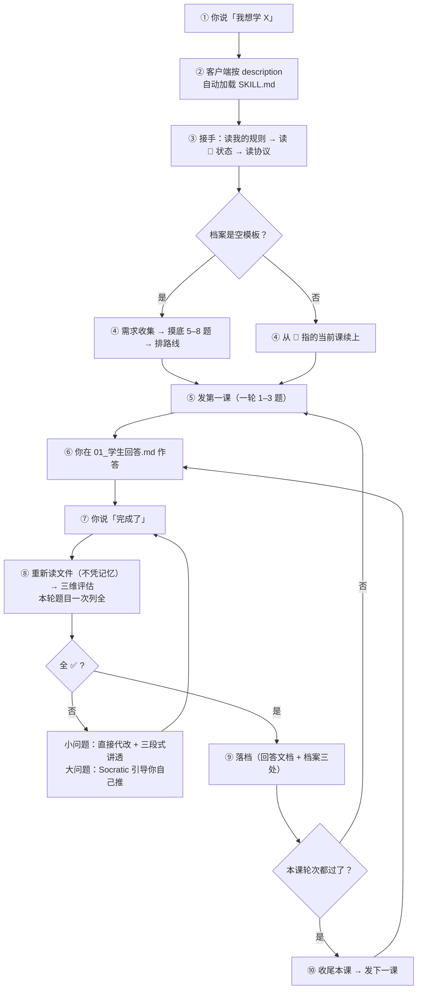

# Steps2Great-skill

[](https://github.com/wildcat430524/Steps2Great-skill/actions/workflows/check.yml)
[](./LICENSE)
[](./LICENSE-DOCS)
[](https://code.claude.com/docs/en/skills)

> **把任何支持 Agent Skills 的 AI，变成你的一对一导师。**
> 摸底 → 排路线 → 每轮只出 1–3 题 → 三维评估全 ✅ 才推进 → 错的地方讲透再往下。

**它不是软件、不是课程、不是网站。** 就是一份 **197 行的 `SKILL.md`**（约 6.5 KB）：
装进你的 AI 客户端之后，那个 AI 就不再是问答题机器，而是**按一份教学协议陪你学**。

**它不教任何特定学科** —— 它规定的是**怎么教**。编程、英语、考研、数学、文科，同一套规矩。

它脱胎于 [StepsToGreat](https://github.com/wildcat430524/StepsToGreat)：那个项目用一个文件夹、一份 `AGENTS.md` 把 AI 变成导师；
本仓库把这套协议**封装成一个可安装、可分发、可校验的通用 skill**。

[English](./README.en.md) | 简体中文

**目录**

[30 秒开始](#30-秒开始) ·
[为什么需要「skill 版」](#为什么需要skill-版) ·
[装它](#装它四条路任选) ·
[怎么用](#怎么用第一次) ·
[适合谁](#适合谁不适合谁) ·
[它是怎么工作的](#它是怎么工作的) ·
[它到底立了什么规矩](#它到底立了什么规矩) ·
[完整对话案例](#一个完整的对话案例) ·
[规矩是怎么验证的](#这些规矩是怎么验证的) ·
[语言策略](#语言策略只用中文还是只用英文) ·
[仓库结构](#仓库结构) ·
[自适应更新](#自适应更新) ·
[开发](#开发) ·
[常见问题](#常见问题) ·
[想更深入了解](#想更深入了解) ·
[许可](#许可)

---

## 30 秒开始

**别急着往下读。** 你只要做三件事：

| # | 做什么 | 你会看到 |
|---|---|---|
| **1** | 一行装上它：`npx skills add wildcat430524/Steps2Great-skill` | 它落进你客户端的 skills 目录（Claude Code 是 `~/.claude/skills/steps2great-skill/`） |
| **2** | 对 AI 说一句：`我想学 Python，目标是能自己处理 Excel，每天 30 分钟。` | 它先问你的需求，然后做摸底、排路线、**发第一课** |
| **3** | 问它：`你加载的 SKILL.md 里，「硬规则」有几条？` | 答出 **11 条** = skill 真的装上了、也真的读到了 |

> **不想用 `npx`？** 一行 `git clone` 放进 skills 目录也一样 —— 见 [装它](#装它四条路任选)。

> **为什么第 3 步要问**：绝大多数客户端没有「查看已加载 skill」的界面，
> **让 AI 复述硬规则条数是唯一可靠的验证方式**。答不出 → 见 [常见问题](#常见问题)。

之后你的日常只有两个动作：**在回答文档里写答案**，和**说一句「完成了」**。

---

## 为什么需要「skill 版」

上一代 [StepsToGreat](https://github.com/wildcat430524/StepsToGreat) 已经证明了这套教学协议管用：
一个文件夹 + 一份 `AGENTS.md`，任何能读文件夹的 AI 都会变成导师。

但它有三个绕不开的边界，**都是「文件夹形态」造成的，不是协议造成的**：

| 上游的边界 | skill 版怎么解 |
|---|---|
| 规则要**跟着仓库走** —— 换个项目就得重新丢一次文件夹 | 装一次进 skill 目录，**所有项目、所有会话都能触发** |
| 触发靠**工具认不认 `AGENTS.md`** —— 25 个跳板文件覆盖 28+ 工具，仍要一个个维护 | 触发靠 **frontmatter `description`**（中英双语触发词），凡是支持 Agent Skills 的客户端都认 |
| 内容**手抄会漂移** —— 规则改一处、副本忘一处 | `references/` 是**镜像生成物**，上游改完跑一次同步脚本，CI 校验一致性 |
| 「协议有没有被遵守」**没人查** | 状态校验器（11 条不变式）+ 11 个回归用例 + CI 每次跑 |

### 和上游的分工

| | [StepsToGreat](https://github.com/wildcat430524/StepsToGreat) | **Steps2Great-skill**（本仓库） |
|---|---|---|
| 形态 | 一个文件夹（打开它就是导师） | 一份 Agent Skill（装进任意客户端） |
| 触发 | `AGENTS.md` + 25 个工具跳板 | frontmatter `description`（双语触发词） |
| 内容来源 | 仓库本体 | **镜像**上游 + 手写的 `SKILL.md` |
| 适合 | 想「一个文件夹带走全部」、想读全部设计文档 | 想「装一次到处用」、想分发/团队共用 |
| 数据归属 | 你的文件夹 | 你的工作区 —— **两者都是纯 Markdown，可以互相接续** |

> **它们是同一套协议的两个壳。** 上游改了教学规则，本仓库跑一次
> `node _build/sync-from-upstream.mjs` 就同步过来 —— 不手抄，所以不漂移。

### 和「把一段 prompt 粘进 AI」的区别

| | 粘贴 prompt | Steps2Great-skill |
|---|---|---|
| 能不能被**自动触发** | ❌ 每次都要你记得粘 | ✅ 说「我想学 X」就被触发 |
| 规则多长 | 你愿意粘的长度（通常几百字） | **按需读取** —— 197 行契约 + 64 份参考，用到哪份读哪份 |
| 会不会漂移 | 版本满天飞 | 单一真相 + 镜像脚本 + CI |
| 状态放哪 | 对话里，关了就没 | 你的工作区文件里，**换客户端也能接上** |
| 能不能被检查 | ❌ | ✅ 11 条不变式 + 11 个回归用例 |

---

## 装它（四条路，任选）

### ① 用 skills CLI 装（一条命令，生态标准做法）

```bash
npx skills add wildcat430524/Steps2Great-skill
```

它会问你装给哪个客户端（Claude Code / Cursor / Codex / Gemini / Cline / Roo / Trae / Zed …），
然后自动放到对应的 skills 目录。常用参数：

```bash
npx skills add wildcat430524/Steps2Great-skill -g              # 装成全局（所有项目可用）
npx skills add wildcat430524/Steps2Great-skill -a claude-code  # 指定客户端
npx skills list                                                # 看装了哪些
npx skills update                                              # 更新
```

### ② 手动 clone 成个人 skill（最省事，所有项目都能用）

把本仓库放进你的 skill 目录，目录名用 `steps2great-skill`（= frontmatter 里的 `name`）：

```bash
# Claude Code / 兼容 Agent Skills 的客户端
git clone https://github.com/wildcat430524/Steps2Great-skill.git ~/.claude/skills/steps2great-skill
```

Windows PowerShell：

```powershell
git clone https://github.com/wildcat430524/Steps2Great-skill.git "$env:USERPROFILE\.claude\skills\steps2great-skill"
```

**各客户端读哪个目录**（不确定就查你客户端的文档；`-g` 装到用户级、不加装到项目级）：

| 客户端 | 用户级目录 | 项目级目录 |
|---|---|---|
| Claude Code | `~/.claude/skills/` | `.claude/skills/` |
| OpenAI Codex | `~/.codex/skills/` | `.codex/skills/` |
| Cursor | `~/.cursor/skills/` 或 `~/.agents/skills/` | `.cursor/skills/` 或 `.agents/skills/` |
| Gemini / Antigravity | `~/.gemini/config/skills/` | `.agents/skills/` |
| 通用位置（多个客户端共读） | `~/.agents/skills/` | `.agents/skills/` |

> Cursor 为了兼容，**也会读** Claude 与 Codex 的目录 —— 所以只装一份到 `~/.claude/skills/` 也能被它认到。
> 想一份目录给多个客户端共用，就用 `~/.agents/skills/`（或把它软链到各客户端目录）。

装完在会话里打 `/steps2great-skill`，或直接说「我想学 X」，AI 会自己判断要不要加载它。

### ③ 装进某个项目（跟着仓库走，团队共用）

```bash
mkdir -p .claude/skills && git clone https://github.com/wildcat430524/Steps2Great-skill.git .claude/skills/steps2great-skill
```

### ④ 包进一个插件 / 分发给你自己的用户

`package.json` 已配好 `files` 白名单（`SKILL.md` + `references/` + `templates/` + `scripts/`），
直接当 npm 包或 git 依赖分发即可。别的 skill 也能通过 `skill steps2great-skill` 调用它。

> **不需要 Node 也能用**：脚本是给「初始化工作区 / 自检 / 更新」用的加分项。
> 你完全可以只说一句「我想学 XX，帮我起个头」，让 AI 手工建目录。

---

## 怎么用（第一次）

装好之后，跟 AI 说一句话就够了：

> **「我想学 Python，目标是能自己处理 Excel，每天 30 分钟。」**

AI 会：读协议 → 建工作区 → 需求收集 → 出摸底题（5–8 题，约 10 分钟）→ 排前 3–5 课 → 发第一课。

之后你的日常只有两个动作：

1. 在 `我的学习/学科/<学科>/NN-<课名>/01_学生回答.md` 里写答案
2. **跟 AI 说「完成了」**

AI 会自动：重新读文件 → 三维评估 → 小问题直接代改并讲透 → 落档 → 出下一轮 / 下一课。

### 想学一整本书 / 一份资料？

把资料丢进工作区的 `资料/`，然后说：

> **「资料我放在 `资料/` 里了，先只用第 1 章教我。」**

AI 会按资料里的**实际内容**教，并注明出自哪份文件的哪一节（允许查证，不允许编书单）。

---

## 不想学东西，只想把一件事想清楚？

同一套追问机制换个对象，就是**质询**：你给一个方案、一个决定、一句含糊的需求，它一路问到你说不出话为止。

| 规矩 | 内容 |
|---|---|
| **只问「现在就能问的」** | 每个问题都建立在**已经定下来的答案**之上；依赖别的未决问题的，这一轮不问，排到后面的轮次 |
| **一轮问全 + 每题附推荐答案** | 当前这一层的所有问题**一次列全、编号**，每题给出**推荐答案** —— 你只需说「同意 / 换一个」 |
| **你的回答长出下一轮** | 定下来的决定把边界往外推，之前问不了的问题自己浮上来；一轮一轮，直到**没有未决项** |
| **事实它查，决定你拍** | 翻文件 / 查资料能解决的，不许拿来问你；摆到你面前的只有「你说了算」的事 |
| **不确认不动手** | 你把最终的理解复述一遍、双方对上，它才开始做 |

**一边问一边沉淀**：结论可以当场落成两份文档 ——

① **决策记录**：一条 = 背景 / 有哪些选项 / 定了哪个 / 为什么 → `references/docs/adr/`；
② **术语表**：同一个词，整个项目里只准有一个意思 → `references/CONTEXT.md`。

目的很朴素：**三个月后，你自己也想得起当初为什么这么定。**

> 和摸底的区别：**摸底**定学习起点（有题、不打分）；**质询**定决策（无题、无对错，只有你说了算）。

---

## 适合谁，不适合谁

**先说清楚，免得你白装一次。**

| ✅ 适合 | ❌ 不适合 |
|---|---|
| 已经在用某个支持 Agent Skills 的 AI 客户端 | 用的客户端**根本不支持 skill**（那请直接用 [StepsToGreat](https://github.com/wildcat430524/StepsToGreat) 的文件夹形态） |
| 自学一门技能，但总半途而废 | 想要现成的课程视频 / 教材 —— **本项目不提供内容** |
| 需要一个盯着你、检查你的角色 | 只想要「问一句答一句」的助手 |
| 目标明确（考试 / 项目 / 补短板） | 完全没目标，只想随便看看 |
| 愿意**动手写答案**（打字或纸笔） | 只想被动听讲，不愿做题 |
| 想长期学（几周到几年） | 只想临时查一个知识点 |
| 手里有自己的资料（教材 / 真题 / 笔记） | 期待 AI 凭记忆编课程 |

> **一句话**：如果你要的是「有人出题、批改、逼你练」，这个项目对口。
> 如果你要的是「内容」，请去找课程 —— 本项目负责的是**那个盯你的人**。

---

## 它是怎么工作的



**全程你只需要说两句话**：开始时的第一句，和每次的「**完成了**」。

### 每课产出两个文档

**这是教学模式的载体** —— 每一课都在你的工作区里生成两个 Markdown：

```
我的学习/学科/Python/03-for循环/
├── 01_教学引导.md    ← 导师写：讲解 + 例题 + 题目（按轮次排布）
└── 01_学生回答.md    ← 你写：在题目下的空位作答；末尾留两个占位区给导师填
```

| 文档 | 谁写 | 里面有什么 |
|---|---|---|
| **`01_教学引导.md`** | 导师 | 为什么要学 → 核心概念 → 示例 → 新旧对比 → 常见陷阱 → 与旧知识的关联 → 题目（按轮次） |
| **`01_学生回答.md`** | **你** | 本轮题目 + 你的作答；**末尾两个占位区**：`## 最终复评结果`（逐题三维表）、`## 正确答案与解析`（三段式） |

**两个关键约定**：

| 约定 | 说明 |
|---|---|
| **回答文档 = 唯一学习证据** | 是否掌握，**只以它的「最终复评结果」为准** —— 不看你聊了什么，不看 AI 说了什么 |
| **按轮次追加，不是一次列全** | 回答文档初始**只有第一轮题目**（1–3 题）；本轮全 ✅ 后，导师再**追加**下一轮 |

> 💡 **为什么是「两个文档」而不是「一个对话」**：
> 对话关掉就没了，文档能留下来。三个月后你想复习「当初 for 循环我错在哪」，
> 打开 `01_学生回答.md` 就能看到原答案、错因、改法 —— **而不是去翻聊天记录**。

---

## 它到底立了什么规矩

**一句话**：三维评估（① 概念理解 / ② 逻辑正确 / ③ 规范表达）**全部 ✅ 才算掌握**，才允许推进下一课。
部分掌握（任一 ⚠️）与未掌握（任一 ❌）都不算 —— **不通过就不发新课**。

几条最关键的（完整 11 条见 [`SKILL.md`](./SKILL.md)）：

| 规矩 | 内容 |
|---|---|
| **一轮 1–3 题** | 按题型成本折算：轻题型最多 3 题，完整算法题/论述题只 1–2 题。**绝不一次把一课的题全发出去** |
| **重读再评估** | 学生说「完成了」→ **必须重新读回答文档**，禁止凭对话记忆判定 |
| **小问题代改** | 笔误/单点语法/缺符号 → 直接改文件，不让学生白答一轮；但必须当场讲透三段式 |
| **大问题引导** | 概念错/逻辑不通 → 走 Socratic，先给最小提示，让学生自己推 |
| **同一个点问 3 次就直给** | 连续 3 次没讲通 → 停止引导，直接给答案 + 要求复述。不在一轮里死磕 |
| **费曼法是诊断工具** | 大模块收尾必做一次；一课最多一次；学生说不想讲就换普通题 |
| **状态只在三处** | 🚦 交接状态 / 📊 掌握表 / ⏳ 待办表。不许同一进度写五个地方 |
| **规则改覆盖层** | 学生要改规则 → 写 `我的学习/我的规则.md`（优先级最高），**不改框架** |

### 三维评估的裁决口诀

拿到任何一处错误，按顺序问 —— 这是本项目最实用的一条：

| 顺序 | 问题 | 判定 |
|---|---|---|
| 1 | 学生**说的东西本身就不对**（概念错、术语错、事实错）？ | **① 概念理解** |
| 2 | 概念没错，但**推理链断了 / 不成立**？ | **② 逻辑正确** |
| 3 | 前面都对，只是**不合该学科的形式规范**？ | **③ 规范表达** |

**口诀：说错了 → ①；想错了 → ②；写错了 → ③。**
同时命中两维 → **按更靠前的判**（① > ② > ③）。**费曼题只评 ①**，另两项标 `— 不适用`。

> 这条口诀不是拍脑袋来的：8 份学科仿真（见下节）发现**6 个学科的核心症状是同一个** ——
> 「这个错该算 ② 还是 ③」判不出来，导致**判定不可复现**（换一个导师评同一份卷子得出不同结论）。
> 所以在 `references/协议/00_导师协议.md` §3 加了这条通用裁决原则。

### 代改：小问题直接改，大问题自己推

| 情形 | 处理 |
|---|---|
| **小问题**（笔误级、单点规范、缺符号、漏关键字、格式小错） | **直接改回答文档**，不让学生再答一轮；但必须**当面讲透三段式** |
| **大问题**（概念理解错、逻辑/推导不通） | 走 Socratic：先给问题或最小提示，学生自己推导修改 |

**代改 = 改文件 + 当面讲透，两件都做才算完成。** 只回一句「已修改」不合格。
三段式长这样：**① 你的原答案 → ② 错在哪、为什么（讲原理）→ ③ 我改成了什么**。

### 费曼法：讲不清 = 没真懂

| 普通题 | 费曼题 |
|---|---|
| 可以套公式、背模板、靠熟悉度蒙对 | 必须自己组织语言，套不了 |
| 答对 ≠ 真懂 | **讲不清 = 一定没懂**（几乎不会误判） |
| 测「能不能做」 | 测「**是不是真理解**」 |

**频率自适应，不会频繁问你**：大模块收尾必做一次；抽象/易混概念值得做；纯操作型不做；
**一课最多一次，不连续两轮出**；学生说「我不想讲，直接考我」→ 尊重他，改用普通题。

---

## 一个完整的对话案例

> ⚠️ **说明**：下面是一次完整学习过程的**场景还原**（按本项目的协议逐条推演，内容真实可信，
> **不是**逐字录音 —— 本项目不收集任何用户对话）。
> 它演示的是「协议跑起来之后，对话会长什么样」。
>
> 场景：Python 零基础学生，目标「写脚本处理 Excel」，从第一次加载 skill 到第三课通过，中间跨了一周。

### 第 1 天 · 第一次加载

**你**：
```
我想学 Python，目标是能自己处理 Excel，每天 30 分钟。
```

**AI**（客户端按 `description` 自动加载了 skill）：
```
我读了协议，也读了你的工作区 —— 学习档案还是空的，所以先做需求收集。

四个问题（一次答完就行）：
1. 你为什么学 Python？→ 想自动处理 Excel，工作要用
2. 以前接触过吗？→ 完全没碰过
3. 打算什么时候用上？→ 这个季度把报表自动化
4. 每天能稳定投入多久？→ 30 分钟，周末可能多点

答完我做摸底测试（5–8 题封顶，但会分几轮问，不会一次砸给你）。
```

**你**：
```
1 工作要用 2 没学过 3 这季度 4 每天半小时
```

**AI**：
```
记下了。摸底第一轮，2 题：

**问题 1**：`print("hi")` 和 `x = 1` 有什么不同？

**问题 2**：写一行代码，把 `3` 和 `5` 加起来并打印出来。

（提示：第 2 题不记得语法没关系，写你知道的部分就行）
```

> 💡 **注意**：摸底也遵守「每轮 1–3 题」—— 不会一上来甩 8 道题。

### 摸底结论（略去中间过程）

**AI**：
```
✅ 摸底结论：起点是 L1 零基础。

   - 已具备：会打开 Excel、知道什么是单元格
   - 需要补：变量、循环、文件读写
   - 建议从：第 1 课「变量与数据类型」开始
   - 预计 8 课能到「写出批量改 Excel 的脚本」

已写入 我的学习/学科/Python/00-摸底测试.md，并排好了前 5 课。
要开始第 1 课吗？
```

### 第 3 课 · 一次典型的一轮

**你**（在 `01_学生回答.md` 里作答）：
```python
# 第一轮 · 问题 1：range(3) 会打印出哪些数字？为什么？
# 答：会打印 0 1 2，因为 range 从 0 开始

# 第一轮 · 问题 2：写代码打印 1 到 5
for i in range(5):
    print(i)
```

**你**：
```
完成了
```

**AI**：
```
我重新读了你的回答文档（本轮 2 题）：

| 题号 | 概念理解 | 逻辑正确 | 规范表达 | 结论     |
|------|----------|----------|----------|----------|
| 1    | ✅       | — 不适用 | — 不适用 | 通过     |
| 2    | ✅       | ❌       | ✅       | 需要修改 |

## 1️⃣ 问题 2：循环范围错了

**你的原答案**
for i in range(5):
    print(i)

**问题在哪里**
- range(5) 产生 0,1,2,3,4 —— 从 0 开始，到 4 结束（**不含 5**）
- 题目要打印 1 到 5，你的输出是 0 到 4：**少一个 5，多一个 0**
- 这是 Python「左闭右开」的约定，也是初学者最容易踩的坑

**我改成**
for i in range(1, 6):
    print(i)

问题 1 你答得对，「range 从 0 开始」这个理解很关键。
改好问题 2 告诉我，我们进第二轮。
```

> 💡 这里体现了三条协议：
> **① 一次性列全本轮全部题目**（不挤牙膏）｜**② 小问题直接代改**（这是写法问题）｜**③ 三段式讲透**。
> 注意「问题 1 你答得对」这句也不能省 —— 否则学生会以为「没说 = 有问题」。

### 大问题走引导（不是代改）

第二轮的题要求「打印 1 到 10 里的偶数」。你写的是：

```python
for i in range(1, 11):
    print(i)
```

**AI**：
```
## 1️⃣ 问题 3：偶数判断漏了

这个和上一题不一样 —— 上一题是**写法**问题（我直接帮你改了），
这一题是**逻辑**问题，得你自己想明白。

你的代码会打印 1 到 10 全部数字，但题目只要**偶数**。

先别急着写代码，回答我一个问题：

> **如果让你用嘴说出「一个数是偶数」的判断标准，你会怎么说？**

（想不出来再看提示：Python 里用什么符号能求余数？）
```

**你**：
```
除以2余数是0
```

**AI**：
```
对，就是这个。那把它写成代码是什么样？
（提示：`%` 求余数，`==` 判断相等，`if` 做选择 —— 三个都用上）
```

**你**：
```python
for i in range(1, 11):
    if i % 2 == 0:
        print(i)
```

**AI**：
```
✅ 对了。你自己推出来的，这个印象会比别人告诉你深得多。本轮 2 题现在都通过了。
```

> 💡 **这就是「小问题代改 / 大问题引导」的分界**：写法错 → 直接改（省你一轮）；逻辑错 → 必须你自己想（那才是学习）。

### 落档 + 发下一课

**AI**：
```
#3 for 循环与 range() 已闭环 ✅

已更新：
- 01_学生回答.md → 最终复评结果 + 正确答案与解析
- 00-学习档案.md → 📊 掌握表新增「for 循环与 range()」+ 🚦 交接状态

**下一步：#4 while 循环与 break**（有些场景 for 写不了，比如「一直读直到文件结束」）

### ✅ 你的任务
完成第一轮 2 题，然后说「完成了」。
```

### 第 7 天 · 一次费曼题（循环模块学完了）

**AI**：
```
循环这个模块学完了。这轮只有 1 道题，但不是普通题 —— 是一道**费曼题**。

不许用这些词：<循环>、<遍历>、<迭代>、<range>

**用你妈能听懂的话解释：为什么电脑需要「重复做一件事」这个功能？**

3–5 句话说清即可。这不是考试 —— 讲不清恰恰说明这里有洞，正好补。
```

**你**：
```
就像洗衣服，你不会一件一件手洗，而是把一堆衣服丢进洗衣机，
设定好程序，它自己转。电脑也一样，你不用写一百遍同样的代码，
只要告诉它「对这一堆东西，每个都做同样的动作」就行。
```

**AI**：
```
✅ 讲清了，而且讲得比我预期的好。

**好在哪**：你用「洗衣机」这个类比非常准 —— 它同时抓住了两件事：
① 你不用重复劳动 ② 你得先「设定程序」（这就是循环体里写什么）

**一个可以更准的地方**：你说「它自己转」—— 但电脑比洗衣机死板，
它**完全不会自己判断该转几圈**，圈数必须你事先说死。这一点正好是你下一课（while）要解决的。

已记进档案：`for 循环与 range()` 备注 = ✅ 且能费曼讲清
```

> 💡 费曼反馈的三个动作：**① 指出好在哪里**（不是敷衍的「讲得不错」）→
> **② 指出一个可以更准的地方，并顺势连到下一课** → **③ 把费曼证据记进档案**（比「做对题」更强的掌握证明）。

### 第 10 天 · 关掉一周后，换了个客户端回来

**你**（新会话，换了一个也支持 Agent Skills 的客户端）：
```
继续
```

**AI**：
```
我读了 我的学习/00-学习档案.md 的 🚦 交接状态：

- 你在学 **Python**（目标：写脚本批量处理 Excel）
- 当前课次：**#4 while 循环与 break**
- 进度：教学已发布，回答文档为空，等待你作答
- 挂起：⏳ 间隔复习 #1（3 个知识点已达触发条件）
- 接手第一步：先做间隔复习，再进 #4

要不要现在做那道复习题？（1 题，覆盖变量 / 数据类型 / for 循环）
```

> 💡 **这就是「状态落盘 + 换壳不换协议」的价值**：换了客户端、隔了一周，
> AI 依然知道你在哪 —— 因为状态在**文件里**，协议在**skill 里**。

### 这个案例演示了什么

| 机制 | 出现位置 |
|---|---|
| 需求收集 → 摸底 → 定起点 | 第 1 天 |
| **每轮只出 1–3 题** | 摸底与每一课 |
| 三维评估（本轮全部题目一次列全） | 第 3 课 |
| **小问题代改 + 三段式** | 问题 2（写法错） |
| **大问题走引导，让你自己推** | 问题 3（逻辑错） |
| **费曼题（大模块收尾，只出 1 题）** | 第 7 天 |
| 明确说「没改的题也没问题」 | 「问题 1 你答得对」 |
| 每课产出两个文档 | 每一课 |
| 落档（回答文档 + 档案三处） | 每课通过后 |
| **换客户端 / 隔一周能接上** | 第 10 天 |

> 想验证这些机制是否真的写进了协议？看 [`SKILL.md`](./SKILL.md)（11 条硬规则、出题节奏、代改协议）
> 与 [`references/协议/00_导师协议.md`](./references/协议/00_导师协议.md)（评估口径 / 未掌握闭环 / 费曼法）。
> **对话是协议的结果，不是摆设。**

---

## 这些规矩是怎么验证的

**这一节是本仓库与上游最大的性格差异。** 上游回答「协议好不好用」，
本仓库还得额外回答一个问题：**封装之后，它还好用吗？**

四类证据，全部在仓库里可查：

| # | 验证方式 | 抓到了什么 | 报告 |
|---|---|---|---|
| **1** | **8 份学科仿真** —— AI 扮演导师跑完整教学对话（含真实错误、反复追问、挫败情绪），再从对话里提炼缺陷 | 8 个学科**全部需要修补**；**6 个的核心症状是同一个**（② ③ 归属判不出来）→ 因此加了「裁决口诀」 | [`references/docs/simulations/`](./references/docs/simulations/) |
| **2** | **弱模型当探针** —— 刻意用最低推理档（`low` / `off`）跑，因为强模型会**猜**出协议没写清的地方、反而掩盖缺陷 | 协议本身 **12/12 × 4 个模型**；封装层 **5 个真缺陷**（3 个校验器 + 模板死链 + 镜像覆盖手改） | [`tests/weak-model-report.md`](./tests/weak-model-report.md) |
| **3** | **端到端跑测** —— 用 AI 完整走一遍「首次使用 → 摸底 → 路线 → 第 1 课 → 三轮教学 → 整课闭环 → 落档」 | 1 个协议空白 + **1 个会让每个用户都踩到的模板坏链接缺陷** + 2 个校验器误报 | [`references/docs/E2E-RUN-REPORT.md`](./references/docs/E2E-RUN-REPORT.md) |
| **4** | **状态校验器** —— 11 条不变式，检查你的档案是不是自洽 | 能查出「标了已掌握却没有复评证据」「上一课没过就往下走」「同一份文档两份复评区」 | [`references/协议/04_状态机.md`](./references/协议/04_状态机.md) |

### 三个数字，说明「加规则 ≠ 提价值」

| 数字 | 含义 |
|---|---|
| **8 个学科全部需要修补** | 三维评估的**机制**是完整的，但**判据**是按维度描述的，不是按错误描述的 |
| **133 条改动建议 → 只采纳 5 条** | 报告的价值是**证据**，规则只取其中会「判据打架」的部分。**明确拒绝了 7 条**，理由写在报告里 |
| **11 条不变式 + 11 个回归用例** | 「先有真实失误、才加规则」—— 每条不变式都能指出它是被哪次实测踩出来的 |

### 最重要的一条：校验器不能惩罚诚实

弱模型测试抓到 3 个校验器缺陷，**它们是同一个模式** ——
模型写得越老实（注明「文档还没建」、备注里把证据和结论写在一起），越容易被判失败。

> **判据应当是「模型的写法人类读起来对不对」，而不是「它有没有猜中我没写出来的格式」。**

修完之后，每个坑都钉了一个回归用例：

| 用例 | 钉住什么 |
|---|---|
| `T1`–`T7`（7 个） | 状态校验器的 3 个真缺陷 + 反向用例（放宽不能过度） |
| `S1`–`S4`（4 个） | **跑一次镜像同步，不能把 skill 侧修好的东西冲掉**（这个坑踩过一次，现在有指纹断言兜底） |

跑一遍看结果：

```bash
npm test        # 11 个用例
```

---

## 语言策略：只用中文，还是只用英文？

这是装 skill 时绕不开的问题。本仓库的选择是**分层处理**，理由如下：

| 层 | 选择 | 为什么 |
|---|---|---|
| **frontmatter `description`** | **中英双语** | 它是**每一轮都在上下文里**的触发层，也是 AI 判断「要不要用这个 skill」的唯一依据。只用一种语言 = 直接砍掉一半用户能触发到的机会。所以这里中文触发词和英文触发词都写 |
| **`SKILL.md` 正文** | **只用中文** | 正文是**规则**，一份就够。双份正文 = 每次改规则要改两处 = 必然漂移。而且协议里大量概念（代改、三段式、落档、可豁免笔误）是有既定中文叫法的，硬翻会失真 |
| **`references/`** | 中文为主 + `references/en/` 英文镜像 | 英文用户需要完整可读的参考；这些英文版**上游本来就在维护**（StepsToGreat 是双语的），镜像过来不产生新的维护负担 |
| **`README`** | 双语两份 | 给人看的门面，成本低、收益高 |

**一句话**：**触发层双语，执行层单语。**
不这么做的话，常见翻车方式有两种 —— 要么正文双语导致规则漂移（改了一处忘了另一处），
要么正文单语言导致另一种语言的用户根本触发不到。

> **一个真实的坑（所以有 `verify-skill-load`）**：frontmatter 的 `description` 若是裸标量且含 `: `，
> 严格 YAML 解析器会直接报 `Nested mappings are not allowed` —— **skill 完全加载不上**，
> 而纯文本看起来毫无异常。现在 `scripts/check.mjs` 和 `_build/verify-skill-load.mjs` 都会拦它。
> 详见 [CONTRIBUTING.md](./CONTRIBUTING.md)。

> 如果你要拿本仓库当模板做自己的 skill：**照着这张表抄**即可。

---

## 仓库结构

```
Steps2Great-skill/
├── SKILL.md                    ← 契约与主循环（197 行，AI 真正读的那一份）
├── references/                 ← 按需读取的参考（64 个镜像文件）
│   ├── 协议/                   ← 教学规则的唯一出处（含状态机与落档事件表）
│   ├── 学科包/                 ← 编程 / 语言 / 文科 / 理科 / 考试，各定自己的三维口径
│   ├── 模板/                   ← 学习档案、课程路线、教学引导、学生回答的空模板
│   ├── docs/simulations/       ← 8 份学科仿真报告（这些规矩是实测出来的，不是拍脑袋）
│   ├── docs/weak-model/        ← 弱模型兼容性测试报告
│   ├── docs/adr/               ← 9 篇架构决策记录（每个取舍的理由）
│   ├── 示例/                   ← 5 分钟跑通全流程的演示
│   ├── 教程/                   ← 人类看的安装与设计说明
│   ├── en/                     ← 英文版镜像（英文用户走这里）
│   └── CONTEXT.md              ← 术语表（同一个词只有一个意思）
├── templates/workspace/        ← 初始化学生工作区时复制过去的脚手架
├── scripts/
│   ├── init-workspace.mjs      ← 在工作区里搭骨架（不覆盖已有文件）
│   ├── update.mjs              ← 自适应更新（永不碰你的学习记录）
│   ├── validate-state.mjs      ← 状态校验器（11 条不变式）
│   └── check.mjs               ← 本仓库自检（frontmatter / 坏链 / 编码 / 镜像一致性）
├── tests/
│   ├── regression-state.mjs    ← 状态校验器回归（7 个用例）
│   ├── regression-sync.mjs     ← 镜像同步回归（4 个用例）
│   └── weak-model-report.md    ← 弱模型当探针的完整报告
├── _build/
│   ├── sync-from-upstream.mjs  ← 从 StepsToGreat 镜像框架文件（含链接改写 + 指纹保护）
│   ├── verify-skill-load.mjs   ← 加载器视角：用真实 YAML 解析器验证能被装进去
│   └── score-workspace.mjs     ← 六维判分器（给被测工作区打分）
└── .github/workflows/check.yml ← CI：加载器 + 回归 + 自检 + 工作区 + 学生资产断言
```

### 为什么 `references/` 不是手抄的

本 skill 的协议内容**不手抄**，而是从 [StepsToGreat](https://github.com/wildcat430524/StepsToGreat) **镜像**。
上游改协议 → 跑一次同步脚本，`references/` 全部跟上，映射关系（含相对链接改写）写在脚本里。

> **两个必须知道的机制（都是踩过坑才有的）**：
> ① **链接要按「复制到哪」重算**：`references/模板/` 是给学生工作区用的脚手架，
> 工作区里没有 `协议/` 目录 —— 模板里的框架链接必须**改写成文字说明**，否则复制过去就是死链。
> ② **手改过的文件不能被镜像冲掉**：`scripts/validate-state.mjs` 是镜像目标，但本仓库在它上面做了上游没有的修复。
> 现在它被标为 **skill 侧独占**，sync 默认跳过，并**每次结束前断言修复指纹还在**，丢了直接退出码 1。

---

## 自适应更新

分两层，别混：

**① 框架自更新**（跨会话、跨学生共用一套规则）

```bash
# 检查工作区脚手架是否需要更新（只报告，不写）
node scripts/update.mjs --root <你的工作区> --check

# 真正更新（只动脚手架与版本锚，永不碰你的学习记录）
node scripts/update.mjs --root <你的工作区>

# 更新 skill 自身
node scripts/update.mjs --self        # git 检出 → git pull --ff-only
```

工作区根会有个 `.steps2great.json` 记账（初始化时的 `skillVersion`）。
AI 接手时比一下版本，低了就**提示一次**「框架有更新，要不要同步」，你同意再动手。

**② 教学自适应**（每个学生都不一样）

| 自适应什么 | 落在哪 |
|---|---|
| 你的偏好（题量、语气、要不要费曼） | `我的学习/我的规则.md` —— **覆盖层，优先级最高** |
| 学到哪、哪些真掌握、有什么挂起 | `我的学习/00-学习档案.md` 的 🚦 / 📊 / ⏳ |
| 一轮出几题、要不要出费曼、纠错走代改还是引导 | 按 SKILL.md 与学科包的口径**当场判断**，不写死 |

**两条铁律**：规则改覆盖层，不改框架；状态只在三处，不重复写。

> **CI 会替你守着这条铁律**：工作流里先给你的规则文件追加一行私有内容并记下哈希，
> 跑完 `update.mjs` 后哈希必须不变 —— 变了 CI 直接红。
> 见 [`.github/workflows/check.yml`](./.github/workflows/check.yml)。

---

## 开发

```bash
node scripts/check.mjs                                    # 仓库自检（frontmatter / 坏链 / 编码 / 镜像漂移）
node _build/verify-skill-load.mjs                         # 加载器视角：用真实 YAML 解析器验证 SKILL.md 能被装进去
node _build/sync-from-upstream.mjs                        # 从上游镜像框架（默认 E:/StepsToGreat）
node _build/sync-from-upstream.mjs --from <路径> --dry     # 只看差异
node scripts/validate-state.mjs --root <工作区>            # 校验某个工作区的状态是否自洽
node _build/score-workspace.mjs --root <工作区>            # 给被测工作区按六维打分
npm test                                                  # 11 个回归用例
```

> **为什么校验器要分这么细**：这四类检查各自拦的都是**踩过的坑** ——
> `check.mjs` 拦 frontmatter 与坏链；`verify-skill-load` 拦「纯文本看不出、但 skill 装不上」的 YAML 硬错误；
> `validate-state` 拦档案自相矛盾；回归用例拦「修好的东西被下一次改动冲掉」。
> 判定口径与由来全部写在 [`CONTRIBUTING.md`](./CONTRIBUTING.md)。

---

## 常见问题

**怎么确认 skill 真的装上了？**
让它复述 `SKILL.md` 里「硬规则」有几条 —— 正确回答是 **11 条**。答不出 = 没加载上。

**我的客户端不加载 skill 怎么办？**
先确认它是否支持 Agent Skills（有的客户端只认自己的规则文件）。
如果确实不支持，直接用上一代 [StepsToGreat](https://github.com/wildcat430524/StepsToGreat) 的文件夹形态 ——
**同一套协议**，把文件夹打开就行。

**换 AI 客户端会丢记录吗？**
不会。全部数据是普通 Markdown，在你的工作区 `我的学习/` 里。换客户端 → 打开同一个工作区 → 说「继续」。

**要花钱吗？**
协议本身免费（MIT + CC BY 4.0）。AI 客户端大多有免费额度。

**要懂技术吗？**
装的时候要会一行 `git clone`（或者让 AI 帮你装）。**用的时候不用** —— 会打字就够了。

**能把一整本书丢进去学吗？**
能，这是最常用的用法。把书放进工作区 `资料/`，说「我要学透它」，
导师会先追问目标与投入时间，再按书里**实际的章节**拆成一课一课。见 [想学一整本书](#想学一整本书--一份资料)。

**AI 会不会瞎编书里的内容？**
协议禁止凭记忆教学（硬规则第 8 条）：教学内容要么来自你放进 `资料/` 的文件，
要么能说出具体可核实的一手来源，引用要精确到「出自哪份文件的哪一节」。

> ⚠️ **诚实边界**：协议能约束行为，但不能保证模型零幻觉。
> 遇到关键结论，建议回原文核对 —— 可以这样问它：
> `这个结论我在资料里找不到。请指出具体文件、章节和原文；找不到就撤回它并说明不确定。`

**我的资料会被上传吗？**
**可能。** 这取决于你用的客户端，本项目无法替你控制。
已知：不少云端 Agent 在索引时会临时上传文件做 embedding。
**敏感资料**建议用支持本地模型的客户端，或先脱敏。

**AI 判错了怎么办？**
直接说「我觉得这题你判错了，理由是…」。协议**明确允许学生质疑**，摸底结论不认同时以学生为准。

**能同时学好几科吗？**
能，但要按规矩来：**一次只有一个「当前学科」**，切换前先把当前这一轮收尾。
完整流程见 [`references/协议/03_落档事件表.md`](./references/协议/03_落档事件表.md)。

**我怎么知道协议有没有被遵守？**
跑状态校验器，它按 [`references/协议/04_状态机.md`](./references/协议/04_状态机.md) 的 11 条不变式检查你的档案：

```bash
node scripts/validate-state.mjs --root <你的工作区>
```

它能查出「标了已掌握却没有复评证据」「上一课没过就往下走」这类错。

**没有对口的学科包怎么办？**
内置 5 个（编程 / 语言 / 文科 / 理科 / 考试）。没有对口的，AI 会照
[`references/学科包/_自定义学科包模板.md`](./references/学科包/_自定义学科包模板.md) 现场生成一个 ——
关键就两问：**这个学科里，什么是「结构性错误」（必须扣分），什么是「手滑」（不扣分）？**
答得出这两问，任何技能都能被评估 —— 吉他、健身、绘画、写作、软件操作都行。

**怎么贡献一个新学科包？**
复制 [`_自定义学科包模板.md`](./references/学科包/_自定义学科包模板.md)，填好，提 PR。
**最缺的是：乐器、健身、绘画、写作、软件操作。**

**怎么改我自己的学习规则？**
写进工作区的 `我的学习/我的规则.md` —— 它是**覆盖层，优先级最高**，
`git pull` 不会冲突，也不用改框架。

---

## 想更深入了解

| 想了解 | 看这里 |
|---|---|
| **AI 到底读什么**（197 行契约与主循环） | [`SKILL.md`](./SKILL.md) |
| 教学规则的唯一出处 | [`references/协议/`](./references/协议/) |
| 哪些错误算哪一维（裁决口诀 + 各学科边界案例） | [`references/协议/00_导师协议.md`](./references/协议/00_导师协议.md) §3 |
| **什么时候该写哪个文件** | [`references/协议/03_落档事件表.md`](./references/协议/03_落档事件表.md) |
| 状态机与 11 条不变式 | [`references/协议/04_状态机.md`](./references/协议/04_状态机.md) |
| 各学科的三维口径怎么定 | [`references/学科包/README.md`](./references/学科包/README.md) |
| 5 分钟跑通全流程的演示 | [`references/示例/演示学科/README.md`](./references/示例/演示学科/README.md) |
| **为什么这些规矩是实测出来的** | [`references/docs/simulations/`](./references/docs/simulations/) |
| 弱模型能不能照做（含 5 个真缺陷） | [`tests/weak-model-report.md`](./tests/weak-model-report.md) |
| 端到端跑测报告 | [`references/docs/E2E-RUN-REPORT.md`](./references/docs/E2E-RUN-REPORT.md) |
| 每个设计决策的取舍 | [`references/docs/adr/`](./references/docs/adr/)（9 篇） |
| 客户端兼容性矩阵 | [`references/docs/AGENT-COMPAT.md`](./references/docs/AGENT-COMPAT.md) |
| 术语定义（导师 vs 载体、框架 vs 数据…） | [`references/CONTEXT.md`](./references/CONTEXT.md) |
| 改什么该提 PR / 怎么同步上游 | [`CONTRIBUTING.md`](./CONTRIBUTING.md) |
| 工作区脚手架为什么是手写的 | [`templates/workspace/README.md`](./templates/workspace/README.md) |

---

## 许可

- **代码 / 脚本**：MIT —— 见 [`LICENSE`](./LICENSE)
- **文档 / 协议**：CC BY 4.0 —— 见 [`LICENSE-DOCS`](./LICENSE-DOCS)

从上游镜像来的内容遵循上游许可。署名建议：

```
基于 StepsToGreat（https://github.com/wildcat430524/StepsToGreat）
与 Steps2Great-skill（https://github.com/wildcat430524/Steps2Great-skill），
采用 CC BY 4.0 许可，原作者已授权。
```

---

**现在开始** → 装好之后，说：

```
我想学 <X>，目标是 <Y>，每天能投入 <Z> 分钟。
```
